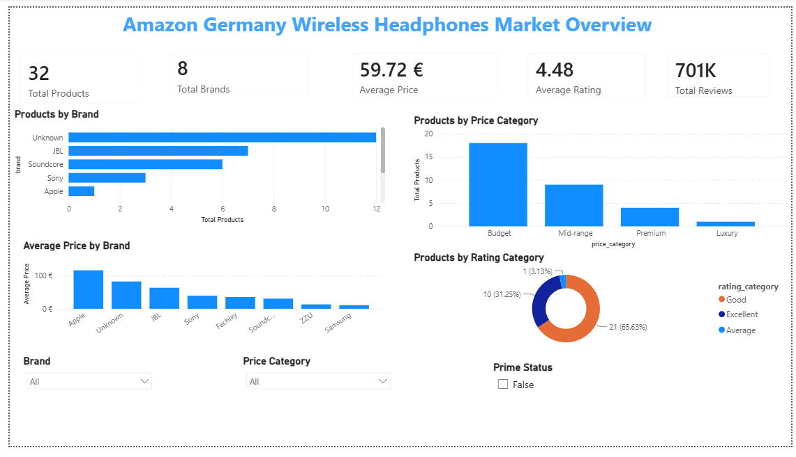
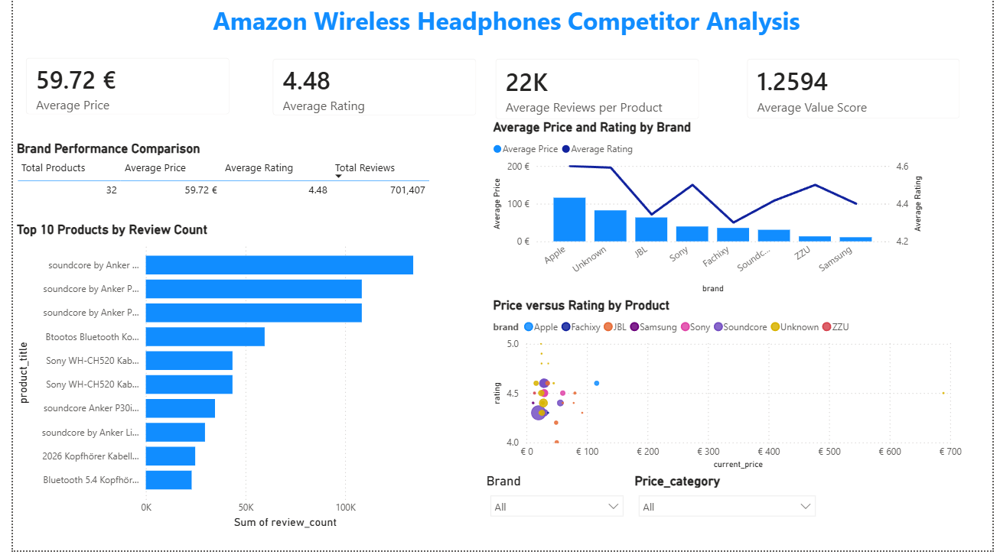

# Amazon Germany Wireless Headphones Competitor Intelligence

## Business Intelligence Final Project

This project builds a complete end-to-end ETL pipeline for collecting, cleaning, storing, analysing and visualising wireless-headphone product data from Amazon Germany.

The solution collects product information through the Amazon Scraper API, transforms the response using Python and Pandas, stores historical observations in PostgreSQL, automates the workflow using Windows Task Scheduler and presents the results through an interactive Power BI dashboard.

---

## Project Overview

The wireless-headphones market contains products from established brands, emerging sellers and generic manufacturers across a wide range of prices.

Customers commonly compare products using:

* Current price
* Product rating
* Review count
* Prime availability
* Sponsored status
* Brand reputation
* Price category

Manually collecting this information is slow and difficult to repeat. This project creates an automated business-intelligence solution that can refresh the data and preserve observations over time.

---

## Business Objective

The objective is to provide an electronics retailer or category manager with competitor and pricing intelligence for wireless-headphone products listed on Amazon Germany.

The project answers questions such as:

1. How many products and brands are represented?
2. What is the average product price?
3. Which brands have the strongest product presence?
4. Which products have the highest ratings and review counts?
5. How are products distributed across price categories?
6. Do higher-priced products receive stronger ratings?
7. How do Prime and sponsored listings compare?
8. Which products appear to provide strong value relative to price and customer response?

---

## End-to-End Architecture

```text
Windows Task Scheduler
        ↓
run_pipeline.bat
        ↓
run_etl_pipeline.py
        ↓
Amazon Scraper API
        ↓
Raw JSON files
        ↓
Python and Pandas transformation
        ↓
Processed CSV and Excel files
        ↓
PostgreSQL database
        ↓
SQL and Python analysis
        ↓
Power BI dashboard
```

---

## Technology Stack

| Area                    | Technology                    |
| ----------------------- | ----------------------------- |
| Data source             | Amazon Scraper API            |
| Programming language    | Python                        |
| Data cleaning           | Pandas and NumPy              |
| Development environment | Jupyter Notebook and Anaconda |
| Database                | PostgreSQL                    |
| Database administration | pgAdmin 4                     |
| Database connection     | SQLAlchemy and Psycopg2       |
| Workflow orchestration  | Windows Task Scheduler        |
| Data analysis           | SQL, Pandas and Matplotlib    |
| Visualisation           | Power BI                      |
| Version control         | Git and GitHub                |

---

## Project Folder Structure

```text
Srikanth_Amazon_BI_Project/
│
├── data/
│   ├── raw/
│   ├── processed/
│   └── exports/
│
├── database/
│   ├── create_database.sql
│   ├── create_tables.sql
│   ├── analysis_queries.sql
│   └── verification_queries.sql
│
├── notebooks/
│   ├── 01_api_exploration.ipynb
│   ├── 02_data_cleaning.ipynb
│   ├── 03_postgresql_loading.ipynb
│   └── 04_data_analysis.ipynb
│
├── powerbi/
│   └── amazon_competitor_dashboard.pbix
│
├── presentation/
│
├── reports/
│   ├── business_case.md
│   ├── data_dictionary.md
│   ├── insights_and_recommendations.md
│   └── live_demo_script.md
│
├── screenshots/
│
├── scripts/
│   ├── database_connection.py
│   ├── run_etl_pipeline.py
│   └── run_pipeline.bat
│
├── logs/
│
├── .env
├── .gitignore
├── README.md
└── requirements.txt
```

---

## ETL Pipeline

### 1. Extract

The Python pipeline sends a request to the Amazon Scraper API using the search query:

```text
wireless headphones
```

The selected marketplace is:

```text
Amazon Germany
```

The API response is saved as a timestamped JSON file inside:

```text
data/raw/
```

### 2. Transform

Python and Pandas are used to:

* Extract product records from JSON
* Standardise column names
* Convert price, rating and review values into numeric formats
* Remove records without required fields
* Remove duplicate ASINs
* Standardise Boolean fields
* Detect product brands from titles
* Create price categories
* Create rating categories
* Add extraction dates and timestamps
* Run data-quality checks

### 3. Load

The transformed data is stored in PostgreSQL using a dimension-and-fact structure.

Products are inserted or updated using their ASIN.

New observations are inserted for each extraction timestamp so that the project can support historical analysis.

---

## PostgreSQL Database Design

### `dim_products`

Stores relatively stable product information:

* ASIN
* Product title
* Brand
* Product URL
* Image URL
* Marketplace
* Search query
* Created and updated timestamps

### `fact_product_observations`

Stores changing product information:

* Current price
* Original price
* Currency
* Discount percentage
* Price category
* Rating
* Rating category
* Review count
* Search position
* Prime status
* Sponsored status
* Extraction date
* Extraction timestamp

### `etl_run_log`

Stores pipeline execution details:

* Pipeline status
* Start and end times
* Extracted record count
* Transformed record count
* Loaded record count
* Raw and processed file locations
* Error message

---

## Data Quality Controls

The pipeline includes checks for:

* Missing required fields
* Duplicate ASINs
* Negative product prices
* Ratings outside the 0–5 range
* Negative review counts
* Duplicate observations
* Fact records without matching product records
* Missing database credentials
* Invalid API responses

Database constraints also prevent invalid prices, ratings, review counts and ETL statuses.

---

## Workflow Automation

The full ETL pipeline is automated using Windows Task Scheduler.

The scheduler runs:

```text
scripts/run_pipeline.bat
```

The batch file calls:

```text
scripts/run_etl_pipeline.py
```

Every execution:

1. Connects to the API
2. Saves the raw JSON response
3. Cleans the product data
4. Updates the processed CSV
5. Loads data into PostgreSQL
6. Adds an ETL execution record
7. Writes execution information to a local log file

---

## Python Analysis

The exploratory analysis notebook connects directly to PostgreSQL and analyses the latest observation for each product.

The analysis includes:

* Product and brand counts
* Average, minimum and maximum prices
* Average ratings
* Total reviews
* Products by brand
* Products by price category
* Products by rating category
* Prime and non-Prime comparison
* Sponsored and organic comparison
* Top-reviewed products
* Top-rated products
* Price-rating relationship
* Exploratory value score

---

## Power BI Dashboard

The Power BI report contains two pages.

### Page 1 — Market Overview

The first page provides:

* Total products
* Total brands
* Average price
* Average rating
* Total reviews
* Products by brand
* Products by price category
* Average price by brand
* Products by rating category
* Brand, price-category and Prime-status slicers



### Page 2 — Competitor Analysis

The second page provides:

* Average price
* Average rating
* Average reviews per product
* Average value score
* Brand-performance comparison
* Average price and rating by brand
* Top products by review count
* Price-versus-rating analysis
* Brand and price-category slicers



---

## Dashboard Results

The final dashboard contains the following results:

| KPI                         |               Result |
| --------------------------- | -------------------: |
| Total products              |                   32 |
| Total brands                |                    8 |
| Average price               |               €59.72 |
| Average rating              |                 4.48 |
| Total reviews               |              701,407 |
| Average reviews per product | Approximately 22,000 |
| Average value score         |               1.2594 |

---

## Key Insights

1. Budget products represent the largest price category, with 18 of the 32 analysed products.
2. The market has a strong overall average rating of 4.48.
3. Twenty-one products are classified as Good and ten as Excellent.
4. JBL has the largest number of products among recognised brands.
5. Soundcore products appear frequently among the most-reviewed listings.
6. Twelve products are classified under the Unknown brand group.
7. Higher prices do not consistently result in better customer ratings.
8. Apple has the highest average brand price.
9. Most products are priced below approximately €100.
10. Affordable products can achieve ratings similar to more expensive alternatives.

---

## Recommendations

1. Prioritise the Budget and Mid-range segments.
2. Compete using value and product quality rather than price alone.
3. Benchmark product performance against JBL and Soundcore.
4. Build verified customer reviews early.
5. Improve brand identification in future pipeline versions.
6. Continue scheduled extraction to create historical price trends.
7. Investigate unusually expensive product listings.
8. Use price-category and brand-level results alongside overall averages.
9. Differentiate products through features, warranty and customer service.
10. Refresh Power BI after every scheduled ETL execution.

---

## Installation and Setup

### 1. Clone the repository

```bash
git clone YOUR_GITHUB_REPOSITORY_URL
cd Srikanth_Amazon_BI_Project
```

### 2. Create an Anaconda environment

```bash
conda create --name srikanth_amazon_bi python=3.11 -y
conda activate srikanth_amazon_bi
```

### 3. Install dependencies

```bash
pip install -r requirements.txt
```

### 4. Create the `.env` file

Create a file named:

```text
.env
```

Add:

```env
AMAZON_SCRAPER_API_KEY=your_api_key_here

DB_HOST=localhost
DB_PORT=5432
DB_NAME=amazon_competitor_bi
DB_USER=postgres
DB_PASSWORD=your_postgresql_password
```

Never upload the `.env` file to GitHub.

### 5. Create the PostgreSQL database

Run:

```text
database/create_database.sql
```

Then connect to `amazon_competitor_bi` and run:

```text
database/create_tables.sql
```

### 6. Run the complete ETL pipeline

```bash
python scripts/run_etl_pipeline.py
```

### 7. Open the Power BI report

Open:

```text
powerbi/amazon_competitor_dashboard.pbix
```

Update the PostgreSQL credentials if required and refresh the report.

---

## How to Run the Pipeline

### Direct Python execution

```bash
python scripts/run_etl_pipeline.py
```

### Windows batch execution

```cmd
scripts\run_pipeline.bat
```

### Scheduled execution

Create a Windows Task Scheduler task that executes:

```text
scripts/run_pipeline.bat
```

---

## Security

The project protects credentials using:

* `.env`
* `.gitignore`
* Environment variables
* SQLAlchemy URL creation

The following information is not included in the repository:

* API key
* PostgreSQL password
* Personal credentials

---

## Limitations

1. The project uses one Amazon Germany search query.
2. API results may change between extraction times.
3. Brand detection is partly based on product-title matching.
4. Some products are classified as Unknown brands.
5. Original prices and search positions were not returned.
6. The dataset represents a limited product sample.
7. The value score is an exploratory project-created metric.
8. Ratings and reviews do not provide complete customer sentiment.
9. Marketplace observations do not prove causal relationships.

---

## Future Improvements

Future versions could include:

* Additional Amazon categories
* Multiple search queries
* Product-detail API endpoints
* Improved brand detection
* Historical price-trend charts
* Review-growth analysis
* Rating-change analysis
* Email notifications for pipeline failures
* Docker containerisation
* Machine-learning price prediction
* Cloud database deployment

---

## Author

**Srikanth**

Business Intelligence Final Assignment
MADSC301 — Business Intelligence
EU Business School Munich
Spring Semester 2026
